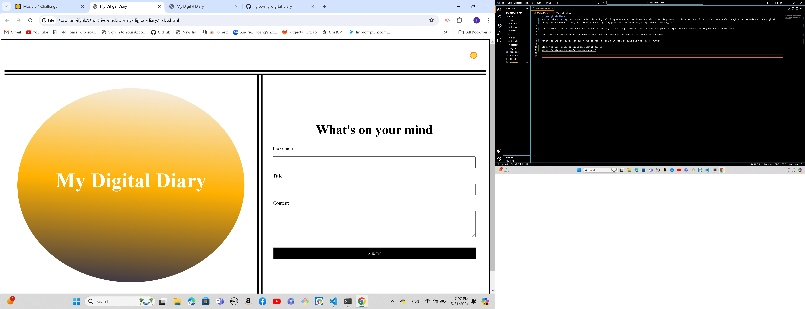
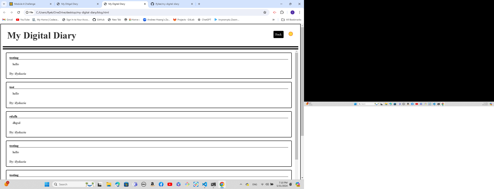

# My-digital-diary
Just as the name implies, this project is a digital diary where user can input and also view blog posts. It is a perfect place to showcase one's thoughts and experiences. My digital diary has a content form , dynamically rendering blog posts and implementing a light/dark mode toggle.

The sun/moon icon at the top right corner of the page is the toggle button that changes the page to light or dark mode according to user's preference. 

The blog is accessed after the form is completely filled out and user clicks the submit buttom.

After reading the blog, you can navigate back to the main page by clicking the [back] button.

Click the link below to visit my digital diary:
https://ifylee.github.io/my-digital-diary/

